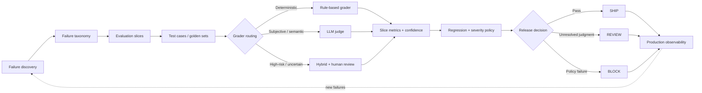

# AI Evaluation Framework

A lightweight, extensible reference implementation for designing and running automated evaluations for LLM and GenAI systems.

The core operating principle is simple:

> Start with how the system can fail, then design the evaluation pipeline around those failure modes.

This repository is built to show how evaluation can move beyond a benchmark score into a **risk-aware release system** with grader routing, regression protection, human escalation, and production feedback.

## What this framework does

- models failure modes as an explicit taxonomy
- organizes evaluation into slices and golden cases
- routes cases to rule-based, LLM-judge, hybrid, or human-review paths
- supports provider-backed LLM judge execution with offline-safe behavior
- escalates low-confidence / high-risk judgments for human review
- applies severity-weighted release policy
- produces explicit `SHIP` / `REVIEW` / `BLOCK` decisions
- converts production failures into reusable eval assets
- emits JSON, Markdown, and HTML release artifacts
- validates the framework in CI with GitHub Actions

## Architecture



## Why this exists

A benchmark tells you how a model scored on a dataset.

An eval pipeline should answer a harder question:

> Can we trust the next model, prompt, or policy change without reintroducing failures we have already paid to discover?

This framework treats production failures as reusable evaluation assets. A meaningful production failure should become one or more of:

- a new failure mode
- a targeted slice
- a golden test case
- a permanent regression gate
- a grader calibration example

Over time, the pipeline becomes **institutional memory for model quality**.

## End-to-end demo

The included demo models a candidate release that performs well on some quality dimensions but regresses on a blocking tool-use slice and produces low-confidence safety judgments.

The framework preserves those differences instead of averaging them into one score.

```text
Candidate model
      ↓
Groundedness          PASS
Instruction following PASS
Safety                REVIEW
Tool use              FAIL
Format compliance     PASS
      ↓
Severity + regression policy
      ↓
RELEASE DECISION: BLOCK
```

See [`docs/DEMO_SCENARIO.md`](docs/DEMO_SCENARIO.md) for the full walkthrough.

## Quick start

```bash
python -m pip install -r requirements.txt
python run_eval.py \
  --config configs/sample_eval.yaml \
  --output artifacts/eval_results.json \
  --report-dir artifacts/reports
```

A run produces structured artifacts that can be consumed by CI/CD or reviewed directly:

```text
artifacts/
├── eval_results.json
└── reports/
    ├── eval_report.md
    └── eval_report.html
```

The console report surfaces the release decision, overall pass rate, weighted risk, pending human review, and slice-level regressions.

## Release policy

The framework does not treat all failures as equivalent.

Each slice can define:

- pass threshold
- maximum tolerated regression
- blocker behavior
- severity weight

The release layer combines failure frequency, severity, regression, grader confidence, and pending human-review state into an explicit decision:

- **SHIP** — configured quality and risk policies pass
- **REVIEW** — no blocking failure, but unresolved human judgment remains
- **BLOCK** — a blocker or release-policy condition fails

This avoids compressing heterogeneous model behavior into one aggregate score.

## Grader routing

Different behaviors require different evaluation strategies.

| Behavior type | Typical strategy | Rationale |
|---|---|---|
| Deterministic requirements | Rule-based grader | Cheap, repeatable, high confidence |
| Subjective quality | LLM judge or calibrated humans | Requires semantic judgment |
| High-risk / low-confidence cases | Hybrid + human escalation | Avoids forcing uncertain judgments into automation |
| Recurrent regressions | Permanent golden tests | Prevents rediscovery of known failures |

The judge is treated as another model in the system, not as ground truth.

## Evaluation observability

Reporting is part of the architecture, not an afterthought.

Every run can generate:

1. **JSON** for CI/CD and downstream automation
2. **Markdown** for pull-request and release review
3. **HTML** for a portable stakeholder-facing release report

Reports preserve slice-level pass rate, regression, severity weight, weighted risk, release rationale, and human-review state.

See [`docs/observability.md`](docs/observability.md).

## Provider-backed judge

The LLM judge layer supports an OpenAI-compatible provider adapter while preserving an offline-safe mode for CI and local development.

A provider failure does not silently become a positive evaluation. The framework fails safely by surfacing uncertainty and escalating to human review when necessary.

## Production feedback loop

A meaningful production failure should not end as a bug fix.

```text
Production failure
      ↓
Reproduce
      ↓
Update taxonomy
      ↓
Create slice / golden case
      ↓
Choose grader + threshold
      ↓
Add regression protection
```

That loop is what turns the framework from a scoring harness into a quality system that improves over time.

## Repository structure

```text
.
├── analysis/              # reports and regression diagnostics
├── configs/               # YAML-driven eval and release policies
├── data/                  # sample cases, golden sets, baseline metrics
├── docs/                  # architecture and operating-model notes
├── graders/               # grader implementations and routing
├── pipeline/              # orchestration, artifacts, gating, feedback loop
├── taxonomy/              # failure-mode definitions
├── tests/                 # unit and integration tests
├── run_eval.py            # CLI entry point
└── requirements.txt
```

## Design principles

1. **Failure-first, not benchmark-first** — define what can go wrong before choosing how to measure it.
2. **Preserve diagnostic resolution** — aggregate metrics are useful only after slice-level behavior is visible.
3. **Route evaluation by risk and judgment type** — deterministic checks, LLM judges, human review, and hybrid strategies have different failure modes.
4. **Treat evaluator confidence as a policy input** — low-confidence or high-impact judgments should not be forced into binary automation.
5. **Make release decisions explicit** — connect evaluation directly to regression tolerance, severity, and launch gates.
6. **Feed production back into evaluation** — new failures should strengthen the framework rather than disappear after incident resolution.
7. **Make every decision auditable** — reports should explain why a release shipped, paused for review, or was blocked.

## Status

This repository is a reference implementation intended to demonstrate evaluation-system design patterns. The sample dataset is deliberately small; teams can replace the data, provider adapter, graders, and release policy without rewriting the full pipeline.
